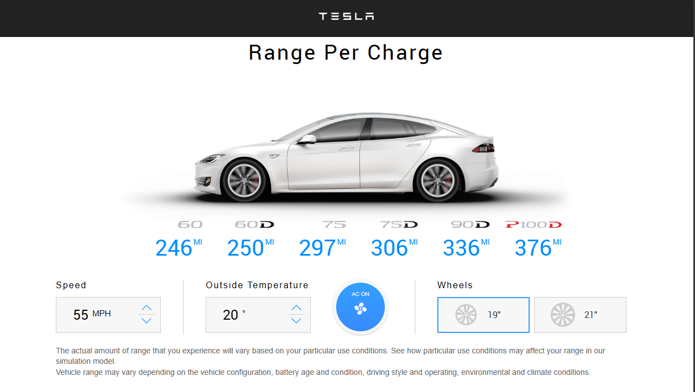

# Tesla Range Calculator

This React application provides an interactive way to estimate the battery range of a Tesla vehicle under various conditions. Users can input wheel diameter, ambient temperature, and vehicle speed to get a calculated range.



## Features

- **Customizable Parameters**: Set different wheel diameters, ambient temperatures, and driving speeds to see their impact on battery range.
- **Responsive Design**: Works on both desktop and mobile browsers for on-the-go calculations.
- **Tesla Model Support**: Choose among different Tesla models to get model-specific range estimations.

## Getting Started

To get a local copy up and running follow these simple steps.

### Prerequisites

- npm
  ```sh
  npm install npm@latest -g
  ```

### Installation

1. Clone the repo
   ```sh
   git clone https://github.com/yourusername/tesla-range-calculator.git
   ```
2. Install NPM packages
   ```sh
   npm install
   ```

### Usage

Start the development server:

```sh
npm start
```

Open [http://localhost:3000](http://localhost:3000) to view it in the browser.

## Built With

- [React](https://reactjs.org/) - A JavaScript library for building user interfaces
- [Tesla Data](#) - Model-specific data

## Contributing

Contributions are what make the open source community such an amazing place to learn, inspire, and create. Any contributions you make are **greatly appreciated**.

1. Fork the Project
2. Create your Feature Branch (`git checkout -b feature/AmazingFeature`)
3. Commit your Changes (`git commit -m 'Add some AmazingFeature'`)
4. Push to the Branch (`git push origin feature/AmazingFeature`)
5. Open a Pull Request

## License

Distributed under the MIT License. See `LICENSE` for more information.